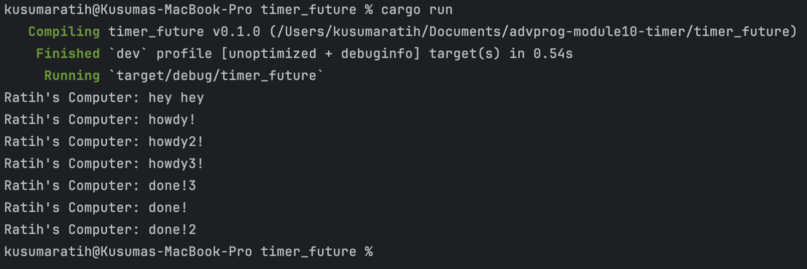
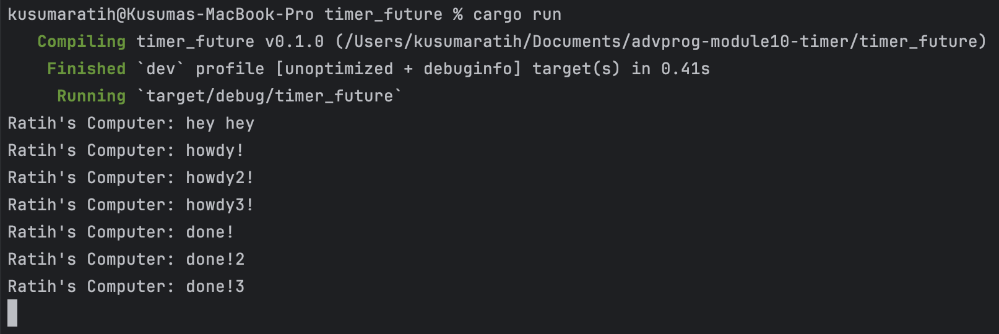

## Kusuma Ratih Hanindyani - 2306256406

### 1.2 Understanding how it works


I added a `println!` statement right after calling `spawner.spawn(...)` in the `main` function:
```rust
println!("Ratih's Komputer: hey hey");
```
This line was placed after scheduling the async task but before the executor is run.
Although the `println!("hey hey")` comes after the `spawner.spawn(...)` line, it appears before the `howdy!` from the async block.
This is because `spawner.spawn(...)` only schedules the task and does not execute it immediately.
The async task only begins running after `executor.run()` is called.
Therefore, the synchronous code that comes right after spawn runs before the executor starts polling the async future.
This proves how asynchronous scheduling works because tasks are enqueued rather than executed instantly and require the executor to drive them forward.

### 1.3 Multiple Spawn and removing drop

#### Multiple Spawn


All three tasks begin executing concurrently after the `executor.run()` is called. They each await a timer for 2 seconds, the order in which their `done!` messages appear may vary each time we run the program.
This shows that async tasks start simultaneously and independently and task completion order is not guaranteed, since they finish based on readiness, not spawn order.
Asynchronous execution does not mean sequential, even when tasks are spawned one after another.

#### Removing Drop


By commenting out the line `drop(spawner)`, the program continued running without terminating on its own.
The purpose of `drop(spawner)` is to signal to the executor that no more tasks will be submitted. Without it the executor assumes that tasks could still be added, so it keeps waiting indefinitely after all spawned tasks have finished. 
As a result, the program hangs because the task queue is empty, but the executor never sees a stop condition.
In conclusion, `drop(spawner)` is critical for graceful shutdown, telling the executor to stop polling once all the tasks in the queue have been completed.