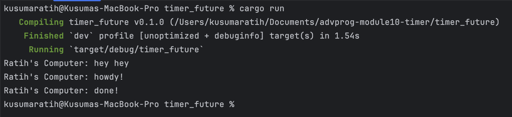

## Kusuma Ratih Hanindyani - 2306256406

### Understanding how it works


I added a `println!` statement right after calling `spawner.spawn(...)` in the `main` function:
```rust
println!("Ratih's Komputer: hey hey");
```
This line was placed after scheduling the async task but before the executor is run.
Although the `println!("hey hey")` comes after the `spawner.spawn(...)` line, it appears before the `howdy!` from the async block.
This is because `spawner.spawn(...)` only schedules the task and does not execute it immediately.
The async task only begins running after `executor.run()` is called.
Therefore, the synchronous code that comes right after spawn runs before the executor starts polling the async future.
This proves how asynchronous scheduling works because tasks are enqueued rather than executed instantly and require the executor to drive them forward.